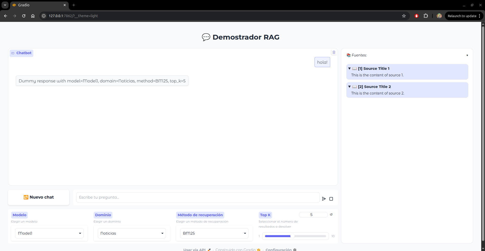

# 📚 Interfaz RAG ILENIA

Este proyecto es un **chatbot basado en RAG** (Retrieval-Augmented Generation) para el proyecto **ILENIA** que responde preguntas utilizando información de documentos indexados en **Elasticsearch**.  


## 🚀 Ejecución

#### 🚀 Lanzar sistema
Para lanzar el sistema, ejecuta el script (se asume que ElasticSearch ya está corriendo en modo servidor):

```bash
./launch_rag.sh
```
A continuación se muestra una captura del sistema en funcionamiento:


> ⚡ **Nota:** El **Reranker** se ejecuta en **GPU** cuando está disponible, ya que el procesamiento se realiza en local.  
> Esto acelera significativamente el paso de *reranking* de los documentos antes de la generación de respuestas.


## 📂 Estructura del proyecto
TO-DO